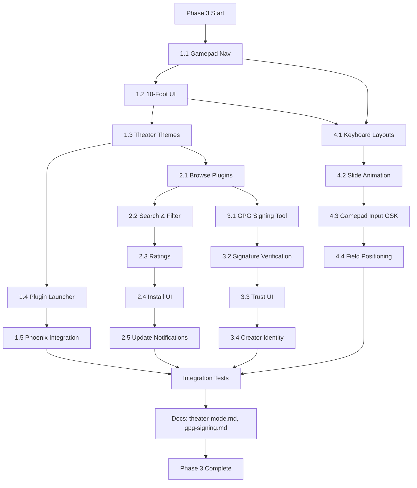

# Campfire Phase 3 Implementation Plan

**Date:** March 14, 2026  
**Context:** Phase 1 (Theme Manifest, Scene Graph) and Phase 2 (Integrity, Format Hardening, Unified Input, Marketplace Feed) completed. Phase 3 delivers Theater Mode + Marketplace UI.

**Goal:** Implement Theater Mode Foundation (10-foot UI, gamepad nav), Marketplace UI (browse, search, install), GPG signatures, and On-screen keyboard.

---

## Campfire Phase Alignment

| Campfire | Phase | Phase 3 Scope |
|----------|-------|---------------|
| [06-Kodi](Cycloside/Campfires/06-Kodi-vs-Cycloside-Theater-Mode.md) | Phase 1 | Theater Mode Foundation — Gamepad nav, 10-foot UI, Theme support, Plugin launcher, Phoenix integration |
| [04-Anti-Store](Cycloside/Campfires/04-Anti-Store-Manifesto.md) | Phase 2 | Marketplace UI — Browse, search, ratings, install/uninstall |
| [CYC-2026-030](Cycloside/Campfires/CYC-2026-030-No-Integrity-Validation.md) | Phase 2 | GPG signatures — Signing, verification, trust UI |
| [05-WebTV](Cycloside/Campfires/05-WebTV-Source-Reconnaissance.md) | Phase 2 | On-screen keyboard (2-3 weeks) |

---

## Phase 2 Recap (Completed)

| Workstream | Delivered |
|------------|-----------|
| 1 | Checksum enforcement, ChecksumGenerator tool, Hash policy (SHA-256 for security) |
| 2 | BinaryFormatValidator (RIFF, ICO, CUR, WAV), Data URI rejection |
| 3 | docs/theme-manifest-schema.md, docs/theme-lua-api.md, docs/scene-graph.md, docs/unified-input.md, docs/marketplace-feed-format.md, examples updated |
| 4 | UnifiedInputQueue, InputEvent, modifier tracking, wake-up mechanism |

---

## Phase 3 Workstreams

### Workstream 1: Theater Mode Foundation

**Source:** [06-Kodi lines 213-241](Cycloside/Campfires/06-Kodi-vs-Cycloside-Theater-Mode.md)

| Task | Description |
|------|-------------|
| 1.1 | **Gamepad navigation system** — Focus manager, D-pad/analog mapping, A=select/B=back, visual focus ring |
| 1.2 | **10-foot UI framework** — Large text (≥24pt), high contrast, simple layout, no tiny icons |
| 1.3 | **Theater themes** — Default Theater theme optimized for TV, quick theme switcher |
| 1.4 | **Plugin launcher** — Tile grid, gamepad-selectable, icons + names, recently used |
| 1.5 | **Phoenix integration** — Visualizer as background/screensaver, music-reactive UI, fullscreen mode |

---

### Workstream 2: Marketplace UI

**Source:** [04-Anti-Store Phase 2 lines 252-258](Cycloside/Campfires/04-Anti-Store-Manifesto.md)

| Task | Description |
|------|-------------|
| 2.1 | **Browse plugins/themes** — List view with icons, descriptions, authors |
| 2.2 | **Search and filter** — Text search, filter by type/tags, sort by rating/date |
| 2.3 | **Ratings and reviews** — Display ratings, review text, review timestamps |
| 2.4 | **Install/uninstall UI** — One-click install from feed, uninstall with confirmation |
| 2.5 | **Update notifications** — Check for updates, display "Update available", auto-update option |

---

### Workstream 3: GPG Signatures & Trust

**Source:** [CYC-2026-030 Phase 2 lines 242-296](Cycloside/Campfires/CYC-2026-030-No-Integrity-Validation.md)

| Task | Description |
|------|-------------|
| 3.1 | **GPG signing tool** — CLI or GUI for plugin authors to sign manifest with GPG key |
| 3.2 | **Signature verification** — Validate GPG signature before install, reject unsigned if policy requires |
| 3.3 | **Trust UI** — Display signature status (verified, unverified, invalid), show key fingerprint |
| 3.4 | **Creator identity** — Link GPG key to creator identity, display in UI |

---

### Workstream 4: On-Screen Keyboard

**Source:** [05-WebTV Phase 2 lines 451-457](Cycloside/Campfires/05-WebTV-Source-Reconnaissance.md)

| Task | Description |
|------|-------------|
| 4.1 | **Keyboard layouts** — Alpha (QWERTY), numeric, symbols. Support custom layouts. |
| 4.2 | **Slide-in animation** — Appear from bottom, smooth transition, semi-transparent backdrop |
| 4.3 | **Gamepad input** — Navigate keys with D-pad, select with A, backspace with B, shift/caps toggle |
| 4.4 | **Field positioning** — Detect active TextBox, position keyboard to not obscure field |

---

## Suggested Order

1. **Workstream 1** (Theater Mode) — Core experience. Creates foundation for OSK and Marketplace Theater view.
2. **Workstream 4** (On-Screen Keyboard) — Depends on Theater Mode nav system (gamepad focus). Theater Mode needs it for text input.
3. **Workstream 2** (Marketplace UI) — Uses Theater Mode if in Theater Mode, normal UI otherwise.
4. **Workstream 3** (GPG) — Integrates into Marketplace UI (signature display, verification).

**Dependencies:**
- 4.3 depends on 1.1 (gamepad nav)
- 2.1-2.5 depend on 1.1 (if Theater Mode active)
- 3.3 depends on 2.1 (Marketplace UI for trust display)

---

## Detailed Task Breakdown

### Task 1.1: Gamepad Navigation System

**Files to create:**
- `Cycloside/Input/GamepadNavigator.cs` (focus manager)
- `Cycloside/Input/GamepadFocusVisual.cs` (focus ring)

**Files to modify:**
- `Cycloside/MainWindow.axaml.cs` (register gamepad handlers)
- `Cycloside/Input/UnifiedInputQueue.cs` (if not already handling gamepad)

**Steps:**

1. Create `GamepadNavigator`:
   - Track focused control (IInputElement)
   - Implement D-pad/analog traversal (find next focusable in direction)
   - Map buttons: A=select (invoke click), B=back, X/Y=context
   - Handle analog deadzone (< 0.3 = no input)
   - Emit navigation sound via AudioService

2. Create `GamepadFocusVisual`:
   - Adorner that draws focus ring around control
   - Animated glow effect (pulsing, 60fps)
   - Attach/detach on focus change

3. Integrate into MainWindow:
   - Hook UnifiedInputQueue for gamepad events
   - Route to GamepadNavigator
   - Apply focus visual to current window

**Validation:**
- Plug in Xbox controller → D-pad moves focus → A button clicks → Focus ring visible

---

### Task 1.2: 10-Foot UI Framework

**Files to create:**
- `Cycloside/UI/TheaterControls.cs` (button, tile, etc. with large text)
- `Cycloside/Themes/Theater/Default.axaml` (Theater theme resources)

**Files to modify:**
- `Cycloside/Views/SettingsWindow.axaml` (add Theater Mode toggle)

**Steps:**

1. Create custom controls:
   - `TheaterButton`: 40pt font, 200x100 min size, high contrast
   - `TheaterTile`: 300x200 tile with icon + name, gamepad-focusable
   - `TheaterMenuBar`: Large font menu for Theater Mode

2. Create Default Theater theme:
   - Black background, white text (or high contrast user preference)
   - 24pt base font, 40pt headers
   - Simple flat design (no gradients, shadows minimal)
   - Focus ring style (3px solid white, glow)

3. Add Theater Mode toggle:
   - SettingsWindow → "Theater Mode" checkbox
   - Save in ConfigurationManager
   - On enable: Apply Theater theme, enable gamepad nav, switch UI mode

**Validation:**
- Toggle Theater Mode → UI redraws with large text → Gamepad nav enabled

---

### Task 1.3: Theater Themes

**Files to create:**
- `Cycloside/Themes/Theater/` directory structure
- `Cycloside/Themes/Theater/theme.json` (Theater theme manifest)

**Files to modify:**
- `Cycloside/Services/ThemeManager.cs` (Theater Mode flag)

**Steps:**

1. Create Theater theme pack:
   - theme.json: `{"name": "Theater Default", "category": "10-foot", "minFontSize": 24, ...}`
   - styles/Buttons.axaml: TheaterButton style
   - styles/Tiles.axaml: TheaterTile style
   - assets/icons/: Large (256x256) icons for Theater Mode

2. Extend ThemeManager:
   - `IsTheaterMode` property (from config)
   - On ApplyThemeAsync: if Theater Mode, prioritize Theater-category themes
   - Quick theme switcher: Y button → cycle through Theater themes

**Validation:**
- Theater Mode on → Theater Default theme applied → Large fonts everywhere

---

### Task 1.4: Plugin Launcher

**Files to create:**
- `Cycloside/Views/PluginLauncherView.axaml` (tile grid)
- `Cycloside/ViewModels/PluginLauncherViewModel.cs`

**Files to modify:**
- `Cycloside/MainWindow.axaml.cs` (Theater Mode → show launcher)

**Steps:**

1. Create PluginLauncherView:
   - WrapPanel or ItemsControl with TheaterTile items
   - Bind to PluginManager.EnabledPlugins
   - Recently used section at top (track last opened)
   - Gamepad-selectable (each tile focusable)

2. Create ViewModel:
   - ObservableCollection of PluginTileViewModel (Name, Icon, LaunchCommand)
   - Track recently used (save in profile)
   - LaunchCommand → PluginManager.GetOrCreatePluginInstance → Show()

3. Integrate:
   - Theater Mode on → MainWindow shows PluginLauncherView instead of tabs
   - Regular mode → Tabs (current behavior)

**Validation:**
- Theater Mode → Launcher view → Navigate with gamepad → A button launches plugin

---

### Task 1.5: Phoenix Integration

**Files to modify:**
- `Cycloside/Plugins/BuiltIn/PhoenixPlugin.cs` (add Theater Mode)
- `Cycloside/Views/PluginLauncherView.axaml` (background visualizer)

**Steps:**

1. Phoenix Theater Mode:
   - `IsTheaterMode` flag → switch to fullscreen visualizer layout
   - Music-reactive: visualizer responds to audio (FFT, beat detection)
   - Screensaver: after 5 minutes idle, Phoenix fullscreen + dim

2. Background visualizer:
   - PluginLauncherView → background Canvas hosts Phoenix
   - Reduced opacity (30%) so tiles visible
   - Optional: user can toggle background visualizer off

**Validation:**
- Theater Mode → Phoenix running in background → Idle 5min → Fullscreen visualizer

---

### Task 2.1: Browse Plugins/Themes

**Files to create:**
- `Cycloside/Views/MarketplaceView.axaml` (list view)
- `Cycloside/ViewModels/MarketplaceViewModel.cs`
- `Cycloside/Services/MarketplaceFeedService.cs` (fetch/parse feeds)

**Files to modify:**
- `Cycloside/MainWindow.axaml` (add Marketplace menu item)

**Steps:**

1. Create MarketplaceFeedService:
   - `LoadFeedsAsync()`: fetch JSON from configured URLs (from config)
   - Parse into `List<MarketplaceItem>` (ID, Name, Description, Author, Icon, DownloadUrl, Checksum, GPGSignature)
   - Cache feeds locally (1 hour TTL)

2. Create MarketplaceView:
   - ItemsControl with MarketplaceItemTemplate (Icon, Name, Author, Description, Install button)
   - Scroll viewer
   - Theater Mode variant: Large tiles, gamepad nav

3. Create ViewModel:
   - LoadCommand: fetch feeds
   - ObservableCollection<MarketplaceItemViewModel>
   - InstallCommand(item): call PluginRepository.DownloadAndInstall

**Validation:**
- Open Marketplace → Plugins/themes listed → Click Install → Plugin downloaded and enabled

---

### Task 2.2: Search and Filter

**Files to modify:**
- `Cycloside/Views/MarketplaceView.axaml` (add search box, filter dropdowns)
- `Cycloside/ViewModels/MarketplaceViewModel.cs` (filter logic)

**Steps:**

1. Add search UI:
   - TextBox for search query
   - ComboBox for type filter (All, Plugins, Themes)
   - ComboBox for tag filter (All, Security, Games, Productivity, etc.)
   - ComboBox for sort (Rating, Date, Name)

2. Implement filter logic:
   - SearchQuery property: filter items by name/description match
   - TypeFilter: filter by item.Type
   - TagFilter: filter by item.Tags
   - SortBy: order by Rating, PublishedDate, Name

3. Theater Mode:
   - Search via on-screen keyboard (Task 4.1-4.4)
   - Filter via gamepad menu (B button → filter menu)

**Validation:**
- Type "game" in search → Only game plugins shown → Sort by rating → Top-rated first

---

### Task 2.3: Ratings and Reviews

**Files to modify:**
- `Cycloside/Services/MarketplaceFeedService.cs` (parse rating/review)
- `Cycloside/Views/MarketplaceView.axaml` (display rating stars)

**Steps:**

1. Extend MarketplaceItem model:
   - Rating (float, 0-5)
   - ReviewCount (int)
   - Reviews[] (optional): Author, Text, Date, Rating

2. Display rating:
   - Star icons (1-5 stars, half-stars supported)
   - Review count "(42 reviews)"
   - Theater Mode: Larger stars

3. Review detail view (optional Phase 3, or defer to Phase 4):
   - Click item → Detail page with reviews
   - Gamepad: A on item → Detail

**Validation:**
- Marketplace item shows "4.5 stars (12 reviews)"

---

### Task 2.4: Install/Uninstall UI

**Files to modify:**
- `Cycloside/ViewModels/MarketplaceViewModel.cs` (install/uninstall commands)
- `Cycloside/Services/PluginRepository.cs` (add uninstall support)

**Steps:**

1. Install flow:
   - Click Install → Progress dialog
   - MarketplaceFeedService downloads ZIP
   - PluginRepository.DownloadAndInstall (already exists, uses checksum from Phase 2)
   - On success: "Installed. Restart to enable."
   - On failure: Show error (checksum fail, GPG fail, etc.)

2. Uninstall flow:
   - Add Uninstall button (if already installed)
   - Confirmation dialog ("Remove plugin X? This will delete all plugin data.")
   - PluginRepository.Uninstall: delete plugin directory
   - On success: "Uninstalled. Restart to apply."

3. Theater Mode:
   - Install/uninstall via gamepad (A button, confirmation with B=cancel/A=confirm)

**Validation:**
- Install plugin from Marketplace → Restart → Plugin enabled
- Uninstall plugin → Confirm → Plugin directory deleted

---

### Task 2.5: Update Notifications

**Files to create:**
- `Cycloside/Services/UpdateChecker.cs`

**Files to modify:**
- `Cycloside/ViewModels/TrayViewModel.cs` (show update notification)

**Steps:**

1. Create UpdateChecker:
   - On startup, check installed plugins against feed
   - Compare version strings (manifest.Version vs. feed.Version)
   - Return `List<UpdateAvailable>` (PluginId, CurrentVersion, NewVersion, ChangelogUrl)

2. Display notification:
   - Tray icon badge ("2 updates")
   - Tray menu: "Update Available: Plugin X"
   - Click → Open Marketplace to update page

3. Auto-update (optional):
   - Config setting: "Auto-update plugins"
   - UpdateChecker silently downloads and replaces plugin
   - Notify: "Plugin X updated to v1.2.3. Restart to apply."

**Validation:**
- Feed has newer plugin version → Tray shows update badge → Click → Marketplace opens

---

### Task 3.1: GPG Signing Tool

**Files to create:**
- `Cycloside/Tools/GpgSigner.cs` (CLI tool or API)

**Steps:**

1. Create GpgSigner:
   - Input: Plugin directory (with manifest.json)
   - Generate detached signature: `gpg --detach-sign -a manifest.json` → `manifest.json.asc`
   - Embed in manifest: Add `"signature": "-----BEGIN PGP SIGNATURE-----\n..."` field
   - Or separate file: `manifest.json` + `manifest.json.asc`

2. CLI usage:
   ```bash
   dotnet run --project Cycloside -- sign-plugin /path/to/plugin --key ABCD1234
   ```

3. Document:
   - docs/gpg-signing.md: How to sign, key generation, best practices

**Validation:**
- Run tool on unsigned plugin → manifest.json.asc created → GPG verify succeeds

---

### Task 3.2: Signature Verification

**Files to modify:**
- `Cycloside/Services/PluginRepository.cs` (add GPG verification)

**Steps:**

1. Add GPG verification to DownloadAndInstall:
   - After checksum validation, before enabling
   - Call GpgVerifier.Verify(manifest, signature)
   - If invalid: reject install, log error
   - If unsigned: warn user, allow if policy permits

2. Create GpgVerifier (use LibGPGError bindings or call `gpg` via Shell):
   - Parse signature from manifest or .asc file
   - Verify against manifest.json content
   - Return: Valid, Invalid, or Unsigned

**Validation:**
- Install signed plugin → GPG verification passes → Install succeeds
- Install tampered plugin → GPG verification fails → Install blocked

---

### Task 3.3: Trust UI

**Files to modify:**
- `Cycloside/Views/MarketplaceView.axaml` (show signature status)
- `Cycloside/ViewModels/MarketplaceItemViewModel.cs` (add signature properties)

**Steps:**

1. Display signature status:
   - Icon: ✅ (verified), ⚠ (unsigned), ❌ (invalid)
   - Text: "Signed by: John Doe <john@example.com>"
   - Key fingerprint (truncated): "1234 5678 ABCD"
   - Click for details: Full key info, web of trust

2. Install confirmation:
   - If unsigned: "This plugin is unsigned. Install anyway?"
   - If invalid: "GPG signature invalid. DO NOT install."
   - If verified: "Verified by [author]."

**Validation:**
- Marketplace shows signature icons → Click for details → Full GPG info displayed

---

### Task 3.4: Creator Identity

**Files to modify:**
- `Cycloside/Services/ThemeManifest.cs` / `PluginManifest.cs` (add GPG field)
- `Cycloside/Services/MarketplaceFeedService.cs` (link GPG to author)

**Steps:**

1. Extend manifest schema:
   - Add `"gpg": {"keyId": "ABCD1234", "fingerprint": "...", "keyserverUrl": "..."}` field
   - Optional: `"author": {"name": "...", "email": "...", "gpgKey": "..."}`

2. Display creator identity:
   - In Marketplace: "By John Doe (verified)"
   - In plugin details: Show GPG key, link to keyserver
   - In installed plugins: Show verification status

**Validation:**
- Plugin manifest has GPG field → Marketplace displays verified author

---

### Task 4.1: Keyboard Layouts

**Files to create:**
- `Cycloside/UI/OnScreenKeyboard.axaml` (keyboard UI)
- `Cycloside/ViewModels/OnScreenKeyboardViewModel.cs`
- `Cycloside/Input/KeyboardLayout.cs` (layout data)

**Steps:**

1. Create KeyboardLayout:
   - Define layouts: Alpha (QWERTY), Numeric (0-9 + symbols), Symbols (!@#$%...)
   - Each layout: 2D grid of keys (row, col, label, value)
   - Support Shift/Caps modifier (toggles layout)

2. Create OnScreenKeyboard UI:
   - Grid of buttons (each key is a button)
   - Current layout displayed
   - Shift/Caps toggle button
   - Close button (top-right)

3. Create ViewModel:
   - CurrentLayout property (switch between Alpha/Numeric/Symbols)
   - KeyPressCommand(key): emit input event to focused TextBox
   - ShiftCommand: toggle Shift state
   - CapsCommand: toggle Caps Lock state

**Validation:**
- Open OSK → QWERTY layout displayed → Press Shift → Uppercase layout displayed

---

### Task 4.2: Slide-In Animation

**Files to modify:**
- `Cycloside/UI/OnScreenKeyboard.axaml` (add animation)
- `Cycloside/ViewModels/OnScreenKeyboardViewModel.cs` (show/hide commands)

**Steps:**

1. Animation setup:
   - Keyboard positioned at bottom (Y = screen height)
   - Show: Animate Y from screen height to (screen height - keyboard height) over 300ms
   - Hide: Animate Y from visible to screen height over 300ms
   - Use Avalonia Animations or RenderTransform

2. Backdrop:
   - Semi-transparent black overlay (30% opacity) behind keyboard
   - Covers screen except keyboard area

**Validation:**
- TextBox focused → OSK slides in from bottom → Smooth animation → Backdrop dims screen

---

### Task 4.3: Gamepad Input

**Files to modify:**
- `Cycloside/ViewModels/OnScreenKeyboardViewModel.cs` (gamepad nav)
- `Cycloside/Input/GamepadNavigator.cs` (OSK mode)

**Steps:**

1. Gamepad navigation for OSK:
   - D-pad: Navigate keys (2D grid)
   - A button: Press key (emit character)
   - B button: Backspace (or close OSK if empty)
   - X button: Toggle Shift
   - Y button: Switch layout (Alpha ↔ Numeric ↔ Symbols)
   - Start button: Space
   - Select button: Enter/Done (close OSK, submit text)

2. Visual feedback:
   - Focused key: highlighted (focus ring)
   - Key press: visual feedback (button press animation)
   - Sound: key press sound (via AudioService)

**Validation:**
- Gamepad → Navigate OSK with D-pad → A presses key → Character inserted → B backspaces

---

### Task 4.4: Field Positioning

**Files to modify:**
- `Cycloside/UI/OnScreenKeyboard.axaml.cs` (positioning logic)

**Steps:**

1. Detect active TextBox:
   - When TextBox focused: Show OSK
   - Get TextBox.Bounds (position on screen)

2. Position keyboard:
   - Default: bottom of screen
   - If TextBox near bottom: position keyboard above TextBox
   - Ensure keyboard doesn't obscure field

3. Auto-dismiss:
   - When TextBox loses focus: hide OSK (with slide-out animation)
   - Or: Keep visible until manually closed (user preference)

**Validation:**
- Focus TextBox near bottom → OSK appears above field (not covering it)
- Focus TextBox at top → OSK appears at bottom

---

## Verification Checklist (Phase 3)

- [ ] Gamepad navigation works (D-pad, A=select, B=back)
- [ ] Theater Mode UI (large fonts, high contrast, simple layout)
- [ ] Theater theme pack created and applied
- [ ] Plugin launcher view (tile grid, gamepad-selectable)
- [ ] Phoenix integration (background visualizer, screensaver)
- [ ] Marketplace browse/search/filter UI
- [ ] Install/uninstall from Marketplace works
- [ ] Update notifications displayed
- [ ] GPG signing tool available for creators
- [ ] GPG signature verification on install
- [ ] Trust UI shows signature status
- [ ] Creator identity linked to GPG key
- [ ] On-screen keyboard (QWERTY, numeric, symbols)
- [ ] OSK slide-in/out animation
- [ ] OSK gamepad input (navigate + press keys)
- [ ] OSK field positioning (doesn't obscure input)
- [ ] docs/theater-mode.md created
- [ ] docs/gpg-signing.md created
- [ ] docs/on-screen-keyboard.md created (or merged into theater-mode.md)
- [ ] Campfires README Phase 3 section added

---

## Out of Scope (Phase 4+)

- **Game arcade** (emulators, high scores) — 06-Kodi Phase 2
- **Media library** (video/music playback) — 06-Kodi Phase 2
- **Decentralization** (multiple feeds, IPFS) — 04-Anti-Store Phase 3
- **Creator tools** (submission, dashboard, forums) — 04-Anti-Store Phase 4
- **Wayland compositor** — 07-Cycloside-as-a-Real-Session
- **Shell replacement** — 07-Cycloside-as-a-Real-Session

---

## Beads Summary

**Theater Mode:** No dedicated bead yet. Create `bd create "Theater Mode Foundation (Phase 3)" -t epic -p 1 --json`

**Marketplace:** cycloside-929 (epic, Phase 2)

**GPG:** cycloside-cn8 (task, Phase 2)

**On-Screen Keyboard:** No dedicated bead. Create `bd create "On-Screen Keyboard for Theater Mode (05-WebTV Phase 2)" -t feature -p 1 --deps discovered-from:cycloside-929 --json`

---

## Mermaid: Phase 3 Execution Order



---

## Task Count Summary

| Workstream | Tasks | Estimated Work |
|------------|-------|----------------|
| 1. Theater Mode | 5 | 2-3 weeks |
| 2. Marketplace UI | 5 | 2 weeks |
| 3. GPG Signatures | 4 | 1 week |
| 4. On-Screen Keyboard | 4 | 2-3 weeks (per 05-WebTV) |
| Integration/Docs | 2 | 1 week |

**Total:** 18-20 tasks, 8-10 weeks estimated

---

## References

- [Campfire 06: Kodi vs Cycloside Theater Mode](Cycloside/Campfires/06-Kodi-vs-Cycloside-Theater-Mode.md)
- [Campfire 04: Anti-Store Manifesto](Cycloside/Campfires/04-Anti-Store-Manifesto.md)
- [CYC-2026-030: No Integrity Validation](Cycloside/Campfires/CYC-2026-030-No-Integrity-Validation.md)
- [Campfire 05: WebTV Source Reconnaissance](Cycloside/Campfires/05-WebTV-Source-Reconnaissance.md)
